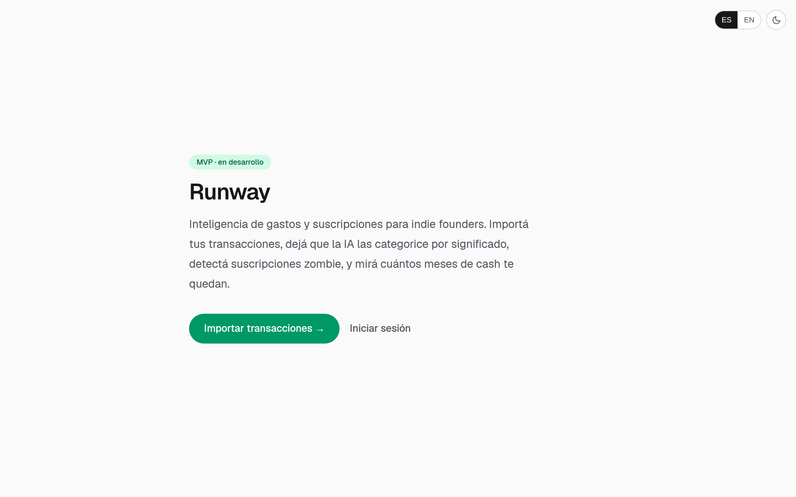
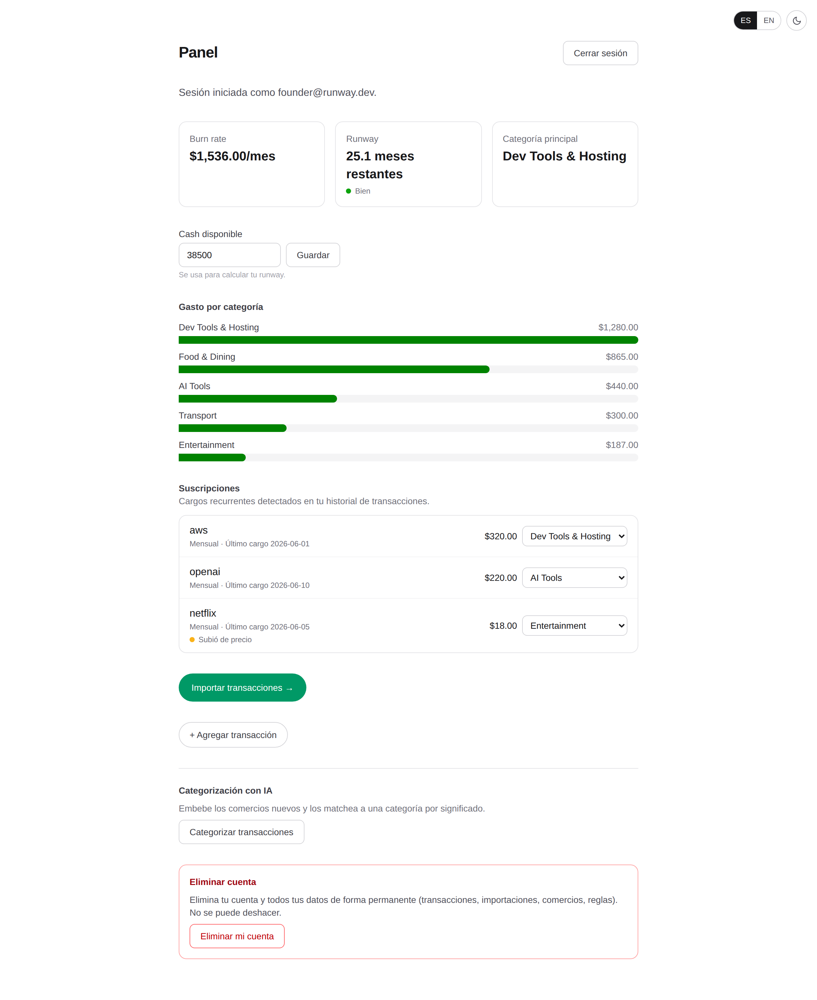
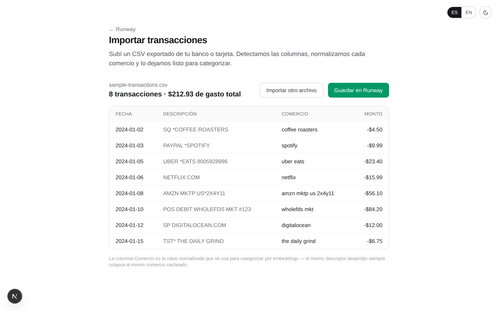
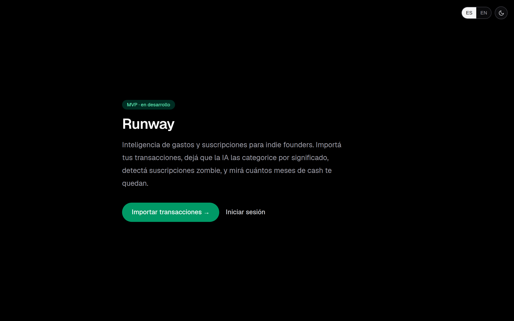

# Runway

[](https://github.com/maximobertinotti2018-wq/runway/actions/workflows/ci.yml)
[](https://github.com/maximobertinotti2018-wq/runway/actions/workflows/supabase-deploy.yml)

**Expense & subscription intelligence for indie founders and freelancers.**

**[→ Live demo](https://runway-blond.vercel.app)** — sign up or use "try it
with sample data" on the import page, no account needed for that part.

Import your transactions (CSV), and Runway categorizes them by meaning using
embeddings, detects zombie/duplicate subscriptions, flags stealth price hikes,
and projects your runway — how many months of cash you have left.

<p>
  
  
</p>
<p>
  
  
</p>

## Stack

- **Frontend:** Next.js (App Router) · Tailwind CSS
- **Backend/DB:** Supabase — Postgres, Row Level Security, `pgvector`, Edge Functions
- **AI:** `gte-small` (384-dim) embeddings for semantic merchant → category matching,
  cached per merchant (embedded once, reused)
- **Hosting:** Vercel

## Status

✅ MVP complete, plus a hardening pass (see below). Live and usable end-to-end.

| Phase | Scope | State |
|-------|-------|-------|
| 1 | DB schema, RLS, `security_invoker` views, category taxonomy | ✅ Done — verified |
| 2 | Auth (email + Google, `@supabase/ssr`) | ✅ Done — verified in production |
| 3 | CSV import + merchant normalization + persistence | ✅ Done — verified in production |
| 4 | Semantic categorization + overrides | ✅ Done — see the eval harness below |
| 5 | Dashboard (burn rate, runway, spend by category, EN/ES, dark/light) | ✅ Done |
| 6 | Subscription detection + price-hike flagging + category override | ✅ Done |

See [`PLAN.md`](./PLAN.md) for the full phased plan and acceptance criteria.

### Hardening pass (post-MVP)

Before calling this portfolio-ready, a second pass closed the gaps a real MVP
demo glosses over:

- **Duplicate-safe re-imports** — a `unique(user_id, occurred_on, raw_description, amount)`
  constraint + `ON CONFLICT DO NOTHING` upsert, so re-uploading an overlapping
  CSV export skips what's already there instead of duplicating it.
- **Forgot/reset password** — a full flow (`/forgot-password` → email →
  `/reset-password`), reusing the existing OTP-verification route rather than
  building a second auth code path.
- **Empty/loading states** — a welcome banner when a new user has nothing
  imported yet, and `loading.tsx` skeletons on the two data-fetching routes.
- **Rate limiting** — the `categorize` Edge Function rejects calls made
  within 30s of the previous one per user (429 + a translated countdown in
  the UI), so a bug or button-mashing can't hammer it in a loop.
- **Delete an import** — `/import` lists past imports with a delete action
  that removes the import and its transactions (RLS-scoped, confirm-before-delete).
- **Manual transaction entry** — an "Add transaction" form on `/dashboard` for
  spend that never comes through a CSV (cash, transfers), reusing the same
  normalize/dedupe path as import.
- **Self-service account deletion** — a `SECURITY DEFINER` RPC hardened like
  `handle_new_user()` deletes the caller's own `auth.users` row; every user
  table cascades from there.
- **Automated E2E suite + CI** — see [Testing](#testing).
- **Categorization eval harness** — the "7/8 on a manual check" claim from
  Phase 4 is now a repeatable, expanded, automated test — see
  [Testing](#testing).

### Phase 4 note: why categorization is a hybrid, not pure embeddings

The first pass (embedding merchants and categories with `gte-small`, matching
by cosine distance) scored 5/8 on a manual accuracy check — `gte-small` has no
brand knowledge, so short bank descriptors like `digitalocean` or `wholefds
mkt` didn't reliably match their category. Enriching the category text with
keywords helped one case but introduced a regression (`"Uber"` as a Transport
keyword pulled `"uber eats"` away from Food & Dining on lexical overlap alone)
— tuning the prompt further didn't converge.

The fix: **known-merchant aliases take priority over embeddings.** A small,
ordered regex table maps common brands (Netflix, DigitalOcean, Uber Eats,
Whole Foods, …) directly to a category; embeddings are the fallback for the
long tail of merchants not in the list, not the primary mechanism. This is
the same pattern real transaction-categorization products use — deterministic
rules for the high-volume common cases, ML for what's left. Original manual
check: 7/8 (87.5%), the one miss (`AMZN MKTP US`) being a merchant name
that's genuinely ambiguous without item-level receipt data — that one-off
check is now a 42-case automated eval, see [Testing](#testing).

## Architecture notes

- **Multi-tenant from day one.** Every user table enforces RLS with
  `(select auth.uid()) = user_id`. Aggregation is exposed through a
  `security_invoker` view — never a materialized view, which would bypass RLS.
- **Embeddings are cached per merchant**, not per transaction, to keep AI cost near zero.
- **Fixed category taxonomy** (not emergent clusters) so results are predictable.

## Deployment

Pushes to `master` touching `supabase/migrations/**` or `supabase/functions/**`
automatically apply pending migrations (`supabase db push`) and redeploy both
Edge Functions via [`.github/workflows/supabase-deploy.yml`](.github/workflows/supabase-deploy.yml)
— no manual SQL Editor or dashboard-editor step. The Next.js app deploys to
Vercel on push to `master`.

## Testing

Four layers, each covering what the others can't:

| Layer | Command | Covers |
|-------|---------|--------|
| Unit tests (Vitest) | `npm test` | Pure logic: CSV parsing, merchant normalization, runway/burn-rate math, subscription detection, i18n interpolation, **the categorization alias eval** |
| E2E (Playwright) | `npm run test:e2e` | Landing, theme/language persistence, CSV import → preview, login/forgot-password shells — everything reachable without a live Supabase session |
| Local DB verification | `bash scripts/db_verify.sh` | Migrations, RLS cross-tenant isolation, `nearest_category`/`nearest_category_match` SQL functions, dedupe constraint — against a throwaway Postgres 16 + `pgvector` cluster, no Docker |
| CI | on every push/PR | Lint + typecheck + unit tests + build (`ci.yml`), then the full E2E suite in a second job |

All four run offline, with no live Supabase project required — a deliberate
constraint carried over from building this in a network-sandboxed environment,
which turned into a genuine strength: the whole suite runs in CI without
secrets beyond what's already there.

### Categorization eval harness

`src/lib/categorization/eval.test.ts` runs 42 realistic raw bank-descriptor
cases through the real `normalizeMerchant` → `matchAlias` pipeline and prints
an accuracy report:

```
Alias-matching eval: 42/42 (100.0%)
```

It checks both directions — merchants that should resolve to a category, and
long-tail merchants that should correctly resolve to nothing (deferred to the
embedding fallback). A false match on the "should stay null" cases is treated
as a failure too, since that's exactly how the historical `"Uber"` /
`"uber eats"` regression happened (see the note above).

This only covers the deterministic alias layer — it can't exercise the
`gte-small` embedding fallback itself, since that only runs inside a deployed
Edge Function against a live Supabase project. `supabase/tests/nearest_category_match_test.sql`
covers that layer's SQL-side distance ranking in isolation instead. To check
the full hybrid pipeline end-to-end, sign in on the deployed app, import
transactions for merchants *not* in `MERCHANT_ALIASES`, run Categorize, and
inspect the results by hand.

Expected `db_verify.sh` tail:

```
PASS: cross-tenant SELECT isolation holds (B sees 0 of A)
PASS: WITH CHECK blocked cross-user insert
PASS: monthly_spend_by_category view honors RLS (security_invoker)
ALL RLS TESTS PASSED
```

## Roadmap (v2 — deliberately not built)

Scoped out of this project on purpose — real integrations, but disproportionate
effort for the portfolio value they'd add relative to everything above:

- **Bank sync (Plaid / Belvo)** — CSV-first was a deliberate v1 decision (see
  `PLAN.md`), not an oversight. A real bank-sync integration means OAuth
  consent flows, webhook-driven ingestion, and credential/token storage —
  a distinct, sizeable feature rather than a natural extension of the CSV path.
- **Billing (Stripe)** — subscription/plan management, webhooks, and a
  customer portal. Meaningful only once there's a real pricing model to
  charge for.
- **Natural-language query console** — "how much did I spend on SaaS in Q2?"
  answered by an LLM translating to SQL against the user's own
  RLS-scoped data. Interesting AI surface, but a genuinely separate feature
  from the categorization pipeline already built.
- **Real multi-currency** — `transactions.currency` exists per-row today, but
  there's no FX conversion at aggregation time; burn rate/runway implicitly
  assume one currency per user.

## Project layout

```
src/app/
  page.tsx              # landing
  login/, forgot-password/, reset-password/, auth/   # auth flows
  import/                # CSV upload -> preview -> save, recent imports + delete
  dashboard/              # burn rate, runway, spend by category, subscriptions
src/lib/
  categorization/         # alias table mirror + eval harness (see Testing)
  csv/, merchants/, import/, dashboard/, subscriptions/   # pure logic, unit-tested
  supabase/               # client/server/middleware Supabase clients
  i18n/, theme/            # EN/ES + dark/light, useSyncExternalStore-backed
e2e/                      # Playwright specs
supabase/
  migrations/   # ordered SQL migrations (schema, RLS, views, seed)
  functions/    # categorize, seed-categories (Deno Edge Functions)
  tests/        # RLS cross-tenant test + local auth emulation + SQL function tests
scripts/
  db_verify.sh  # spin up local PG + pgvector, apply migrations, run tests
.github/workflows/
  ci.yml               # lint, typecheck, unit tests, build, E2E
  supabase-deploy.yml  # auto-deploy migrations + Edge Functions on push
PLAN.md         # phased implementation plan
```
